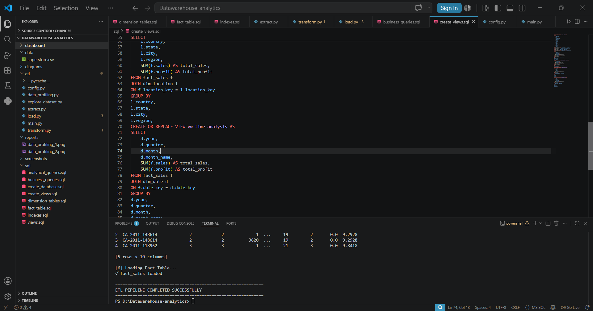
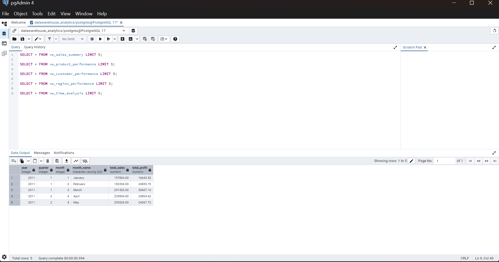

# 📊 Data Warehouse and Business Analytics Platform

InternID : CITS5207

A complete end-to-end Data Warehouse and Business Analytics solution built using **PostgreSQL, Python, SQL, and Power BI**. This project demonstrates the complete Business Intelligence workflow, including ETL pipeline development, dimensional data modeling, analytical SQL, interactive dashboards, and business KPI reporting.

---

## 🚀 Project Overview

Modern organizations generate large volumes of transactional data that must be transformed into meaningful business insights.

This project implements an industry-standard data warehouse using the **Star Schema** approach. Raw transactional data is extracted, transformed, and loaded into PostgreSQL, where analytical queries and Power BI dashboards provide decision-making insights.

The project also demonstrates how the same architecture can be migrated to **AWS Redshift** with minimal changes.

---

# 🛠 Tech Stack

| Technology | Purpose |
|------------|---------|
| Python | ETL Pipeline |
| PostgreSQL | Data Warehouse |
| SQL | Analytical Queries |
| Power BI | Dashboards & Reports |
| Pandas | Data Transformation |
| VS Code | Development |
| Git & GitHub | Version Control |

---

# 📂 Project Structure

```
DataWarehouse-Analytics
│
├── data/
│   └── superstore.csv
│
├── etl/
│   ├── extract.py
│   ├── transform.py
│   ├── load.py
│   ├── main.py
│   ├── config.py
│   └── data_profiling.py
│
├── sql/
│   ├── create_database.sql
│   ├── dimension_tables.sql
│   ├── fact_table.sql
│   ├── indexes.sql
│   ├── create_views.sql
│   ├── analytical_queries.sql
│   └── business_queries.sql
│
├── dashboard/
│   └── reports.pbix
│
├── screenshots/
│
├── reports/
│
└── README.md
```

---

# 📈 Business Problem

Organizations struggle with:

- Large transactional datasets
- Slow business reporting
- Poor analytical performance
- Difficult KPI tracking
- Inefficient decision making

This project solves these problems using a centralized dimensional data warehouse.

---

# ⭐ Features

- Complete ETL Pipeline
- Data Cleaning
- Star Schema Design
- PostgreSQL Data Warehouse
- Fact & Dimension Tables
- SQL Analytics
- Business KPI Reports
- Power BI Dashboards
- AWS Redshift Compatible Design

---

# 🏗 System Architecture

## Overall Architecture

```text
                 Raw Dataset (CSV)
                        │
                        ▼
               Python ETL Pipeline
        ┌──────────┬──────────┬──────────┐
        │ Extract  │ Transform│   Load   │
        └──────────┴──────────┴──────────┘
                        │
                        ▼
              PostgreSQL Data Warehouse
                        │
        ┌───────────────┼────────────────┐
        ▼               ▼                ▼
 Dimension Tables   Fact Table      SQL Views
                        │
                        ▼
                 Analytical SQL
                        │
                        ▼
                Power BI Dashboards
                        │
                        ▼
               Business Decision Making
```

---

## AWS Mapping

| Local Implementation | AWS Equivalent |
|----------------------|---------------|
| CSV Dataset | Amazon S3 |
| Python ETL | AWS Glue |
| PostgreSQL | Amazon Redshift |
| SQL Views | Redshift Views |
| Power BI | Amazon QuickSight |
| Local Scheduler | EventBridge |

---

# ⭐ Star Schema

```
                   Dim Customer
                        │
                        │
Dim Product ───── Fact Sales ───── Dim Date
                        │
                        │
               Dim Shipping
                        │
                        │
                 Dim Location
```

---

# 🗄 Database Schema

## Fact Table

- Fact_Sales

Measures

- Sales
- Profit
- Quantity
- Discount

Foreign Keys

- Customer
- Product
- Date
- Location
- Shipping

---

## Dimension Tables

### Customer

- Customer ID
- Customer Name
- Segment

### Product

- Product ID
- Product Name
- Category
- Sub Category

### Location

- Country
- State
- City
- Region

### Shipping

- Ship Mode

### Date

- Date
- Month
- Quarter
- Year
- Weekday

---

# 🔄 ETL Workflow

### Extract

- Read CSV dataset
- Validate records
- Profile data

### Transform

- Remove duplicates
- Convert data types
- Create surrogate keys
- Build dimensions
- Build fact table

### Load

- Load Dimensions
- Load Fact Table
- Create SQL Views

---

# 📊 Business KPIs

- Total Sales
- Total Profit
- Total Orders
- Profit Margin
- Sales by Region
- Sales by Category
- Sales by Segment
- Monthly Sales Trend
- Top Customers
- Top Products

---

# 📉 Power BI Dashboards

### Executive Dashboard

- KPI Cards
- Monthly Sales Trend
- Sales by Category
- Sales by Segment

---

### Product Dashboard

- Top Products
- Product Profitability
- Category Analysis

---

### Regional Dashboard

- Region Performance
- State Analysis
- City Sales

---

# 📷 Screenshots

## Project Structure



---

## PostgreSQL Tables




# 📈 Sample Business Queries

### Top 10 Products

```sql
SELECT
p.product_name,
SUM(f.sales) AS total_sales
FROM fact_sales f
JOIN dim_product p
ON f.product_key = p.product_key
GROUP BY p.product_name
ORDER BY total_sales DESC
LIMIT 10;
```

---

### Sales by Region

```sql
SELECT
l.region,
SUM(f.sales)
FROM fact_sales f
JOIN dim_location l
ON f.location_key=l.location_key
GROUP BY l.region;
```

---

# 📚 Learning Outcomes

- Dimensional Data Modeling
- Star Schema Design
- ETL Development
- PostgreSQL Administration
- SQL Optimization
- Business Analytics
- Data Warehousing Concepts
- Power BI Dashboard Development
- Data Engineering Best Practices

---

# 🎯 Future Improvements

- Incremental ETL
- Apache Airflow
- Docker Deployment
- AWS Redshift Migration
- Amazon S3 Integration
- Real-time Streaming Pipeline

---

# 👩‍💻 Author

**Reshma R**

B.Tech Artificial Intelligence & Data Science

Panimalar Engineering College

LinkedIn: https://www.linkedin.com/in/reshma-r-40b91630b

---

# ⭐ If you found this project useful, consider giving it a star!
